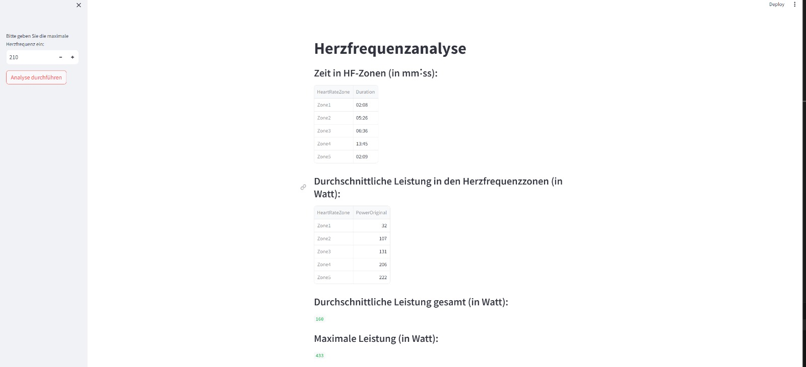
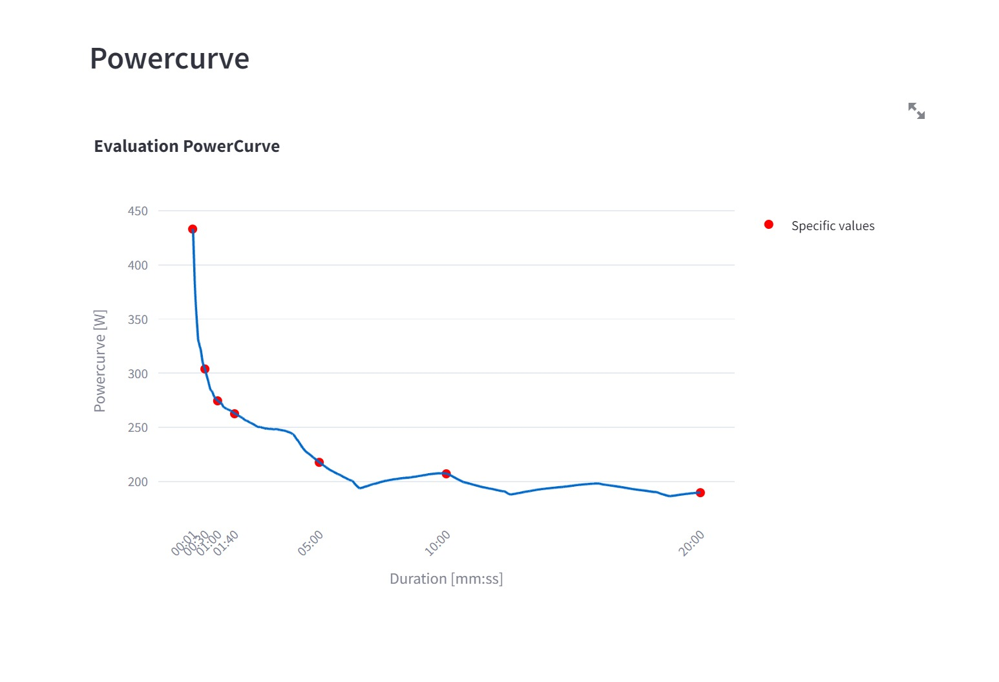

# Programmierübung_2_K_M_M
## interaktiver Plot
### Clonen des Github-Repository auf den PC:

    Öffne Git Bash, navigieren zu dem gewünschten Ordner: cd "<gewünschter Ordner>"
    Repository in Ordner klonen: git clone
    Öffnen Ordner in VS Code

### Virtuellen Bereich erstellen:

    Öffnen eines neues Terminals --> windows Powershell
    Folgender Befehl erstellt einen Virtuellen Bereich: python -m venv .venv
    Folgender Befehl ein aktiviert Virtuellen Bereich: ..venv\Scripts\Activate
    Falls dieser nicht funktioniert: Zugriff erlauben: Set-ExecutionPolicy RemoteSigned Scope CurrentUser
    Der Virtuelle Bereich ist nun erstellt und aktiviert

### Nötigen Pakete installieren:

    Nötige Pakete sind in der Text-Datei requirements.txt angeführt
    alle Pakete gleichzeitig installieren: pip install -r requirements.txt (in Komandozeile von Windows Powershell)

### Verwenden des Codes 3_interaktiver_plot

    mit dem Befehl: streamlit run .\B_interaktiver_plot\main3.py startet die App
    In der App links oben Eingabefenster für die maximale Herzfrequenz und der Button "Analyse starten" zum Starten 
Die App zeigt dann: 
* Tabellen Zeit in HF-Zonen, durchscnittliche Leistung in den HF-Zonen                     
* durchschnittliche Leistung gesamt und die maximale Leistung
* Diagram Leistung über die Zeit

### Verwendung des Codes 4_eigene_Funktionen

    mit dem Befehl: streamlit run .\C_eigene_Funktionen\main4.py startet die App
    Die App zeigt dann die Powercurve mit den spezifischen Werten zu gewissen Zeiten

### Verwendung des Codes 5_zusammenführung
    mit dem Befehl streamlit run .\D_zusammenfuehrung\Patienten-Datenbank.py startet die App
Die App zeigt dann: 
* unter "Wählen Sie einen Patienten aus" ein Dropdown Menü, zum auswählen einer Person --> Das Bild des Patienten und der Name werden nach der Auswahl angezeigt.                     
* Darunter ist "Wählen Sie einen EKG-Test aus", mit einem Dropdown Menü zum Auswählen der verfügbaren Tests. Der ausgewählte Test wird nach der Auswahl angezeigt, ebenso wie die durchschnittliche Herzfrequenz und die Herzfrequenzkurve.
* Darunter gibt es noch die Möglichkeit "Wählen Sie einen Leistungstest aus".
--> Ist ein Test vorhanden, so kann man einen auswählen und anschließend entscheiden, ob man die Herzfrequenzanalyse durchführen, oder die Powercurve anzeigen will.
--> Ist kein Test vorhanden wird "Noch kein Leistungstest vorhanden" angezeigt.